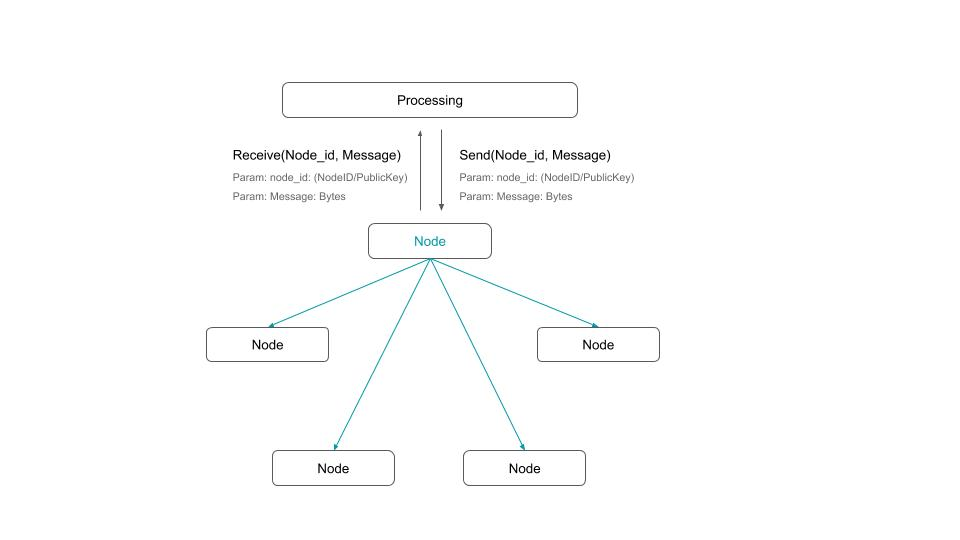

[English](./README.md) / [中文](./README_zh.md)

- Start Date: 2019-06-03
- RFC PR #0
- TDN Issue #0

Summary 摘要
=======

设计一种可信的分布式网络,让每个人能够自由并且安全地管理自己的数据,开发者可以基于这套网络实现可交互,可计算,无服务器的应用,同时帮助应用间打通沟通和数据壁垒.

Motivation 动机
==========

世界上有各种各样的应用,有各种各样的需求,所以我们不能严格限定可信分布式系统的数据结构,账户体系,共识算法,沟通算法,传播算法.我们只限制应用与应用之间的沟通方式,应用与应用间的数据共享机制,以及如何在应用间达成更稳定可靠的一致性结果.因此我们这个项目的核心库将封装好各种繁琐的技术细节,并对应用间通信和数据规范做必要的约束,同时将逐步提供P2P网络库,分布式存储库,虚拟机库,分布式计算库以及隐私数据存取和隐私计算的库等.开发者可以根据自身的需求进行取舍.因此,该项目由一系列基础设施库组成.

Design 设计
===============

### Design Concept 设计理念
- 支持不同的数据结构
- 支持不同的共识算法
- 支持不同的许可机制
- 支持不同的帐号体系
- 应用间能够相互沟通
- 信任可以传递和积累

[详细设计 RFC](https://github.com/placefortea/TDN/blob/master/rfcs/1_design.md)

### Core Library 核心组件库
#### - [Teatree](https://github.com/placefortea/teatree) - [RFC](https://github.com/placefortea/TDN/blob/master/rfcs/2_architecture_and_infrastructure.md)
  基础架构实现和基础设施库,包括网络库,通信库,存储库,密码学库,基本类型和约束库等.
#### - [Black Tea](https://github.com/placefortea/black_tea) - [RFC](https://github.com/placefortea/TDN/blob/master/rfcs/3_distributed_storage.md)
  可插拔分布式存储库,作为库提供可控环境和非可控环境下的分布式存储机制.
#### - Virtual Computing Machine - Not yet
  可插拔虚拟机库
#### - Distributed Computing - Not yet
  可插拔边缘计算库
#### - Privacy Data - Not yet
  可选隐私数据模型
#### - Privacy Computing - Not yet
  可选隐私数据计算模型

### Auxiliary library 辅助库
- [Oolong Tea](https://github.com/placefortea/oolong_tea) - 许可库, 节点准入算法,基于PGP的可信任无中心化PKC模型.
- [Gossip Tea](https://github.com/placefortea/gossip_tea) - 基于Gossip的无交互的共识进程库.
- [PBFT](https://github.com/placefortea/pbft_tea) - PBFT 共识.
- [KeyStore](https://github.com/placefortea/keystore_tea) - 私钥和账户信息安全存取库.
- [rcmerkle](https://github.com/rust-cc/rcmerkle) - 高效的Merkle树计算函数以及状态机型计算.
- [rckad](https://github.com/rust-cc/rckad) - 易用的S/Kademlia的实现.
- [rcmixed](https://github.com/rust-cc/rcmixed) - 密码混合系统,根据PGP衍生而来,已用来加密存储私钥和账户.

## License

This project is licensed under either of

 * Apache License, Version 2.0, ([LICENSE-APACHE](LICENSE-APACHE) or
   http://www.apache.org/licenses/LICENSE-2.0)
 * MIT license ([LICENSE-MIT](LICENSE-MIT) or
   http://opensource.org/licenses/MIT)

at your option.

## Communication
- **TDN** - Telegram Group: https://t.me/placefortea
- **TDN中文** - QQ群: 757610599
