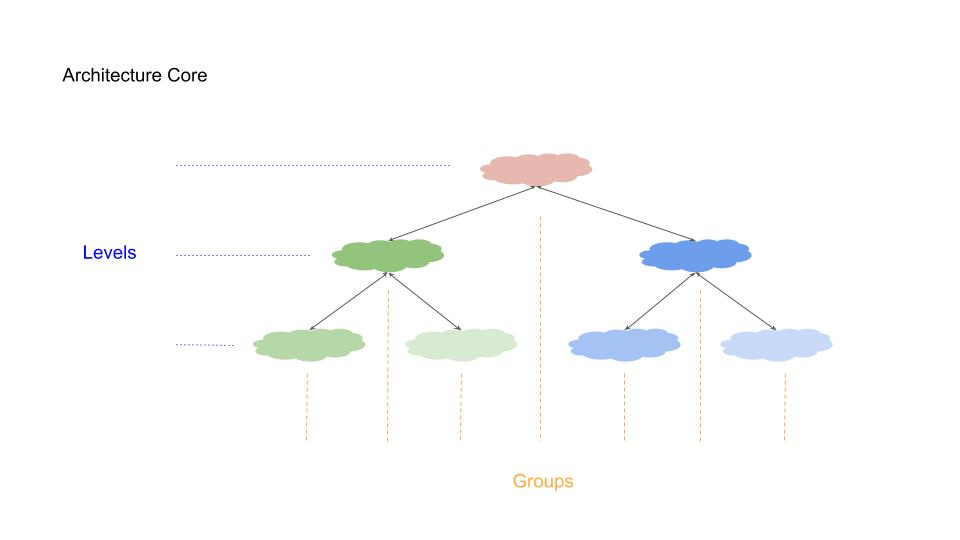
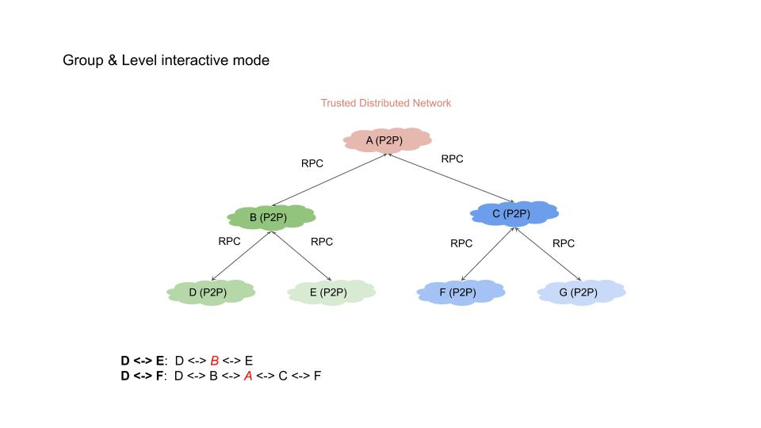

- Start Date: 2019-06-21
- RFC PR #1
- TDN Issue #1

Summary
=======

Design a trusted distributed network that allows everyone to manage their data freely and securely. Developers can implement interactive, computable, serverless applications based on this network, while helping to communicate and data between applications.

Motivation
==========

Not yet

Detailed Design
===============

### Architecture Design
- Support different data structures
- Support different consensus algorithms
- Support different permission mechanisms
- Support different account systems
- Applications can communicate with others
- Trust can be passed on and accumulated

In the design, the communication efficiency and consensus cost are considered comprehensively, and the grouping and layering architecture is designed. The architecture design is introduced below.

##### Group
Each application has its own group ID. Only nodes with the same group ID can connect to each other to interact. The communication within the group is guaranteed by the P2P network.
In the group, you can customize the data structure, custom consensus algorithm, custom propagation algorithm, custom node account information, node join and exit logic, customize the way and permissions to communicate with other groups.
Maximum protection within the group is completely free. At the same time, the project provides a series of auxiliary libraries to help developers quickly implement the functions within the group, including the licensing environment, non-licensed environment, consensus algorithm, etc.
At present, there is no unique detection of the Group ID of the whole network. Later, a function will be developed to assist developers to query which Group IDs have been used, as well as Group ID upgrades, replacement management, etc.
To facilitate different groups to find and communicate.

##### Level
Because there are different groups, the communication between groups needs to be strictly restricted. We have designed a layered architecture to help different groups to communicate effectively and share data.
Hierarchical architecture is a tree structure, each group is a node in the tree, which requires that all groups need to configure their own upper group, of course, the upper group may be a valid group, or it may be invalid.
When the node is started, it will take the initiative to determine the group it is in, as well as its own upper group. The upper group will be subject to the registration request of the lower group. You can choose to accept it, or you can choose not to accept it. If you accept it,
It means that it will communicate with the lower layers, or help the lower layers to communicate with other groups. This design is to improve the consensus effect. If an application has a high requirement for consensus, it is not only necessary to have its own consensus.
It is also necessary to broadcast this consensus result so that other subscribers can understand the consensus result, and it needs the upper layer to help distribute it to achieve more stable results.

##### Data structure
In the architecture design, there is no requirement for the data structure, but some basic nodes are set up, some method calls of the data package are made, and the basic library is convenient for abstract call, and the developer can choose to implement according to requirements.
You can also choose not to implement according to the requirements, and will not affect the use of your own applications.

##### Core Components
In addition to the core library of the network library Teatree, we also provide distributed repository BlackTea.
In Teatree, we encapsulate the details of the underlying network transmission, as well as the various issues of the P2P network to build communication channels, and encapsulate the JSONRPC structure to facilitate external calls and layer communication.
Developers can customize the processing logic for different access requests. In addition, we will gradually implement virtual machine libraries, distributed computing libraries, private data access and privacy calculation libraries to help developers build their own fast and efficient. application.

Drawbacks
=========

Not yet

Alternatives
============

Not yet

Unresolved questions
====================

Not yet
